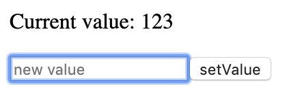
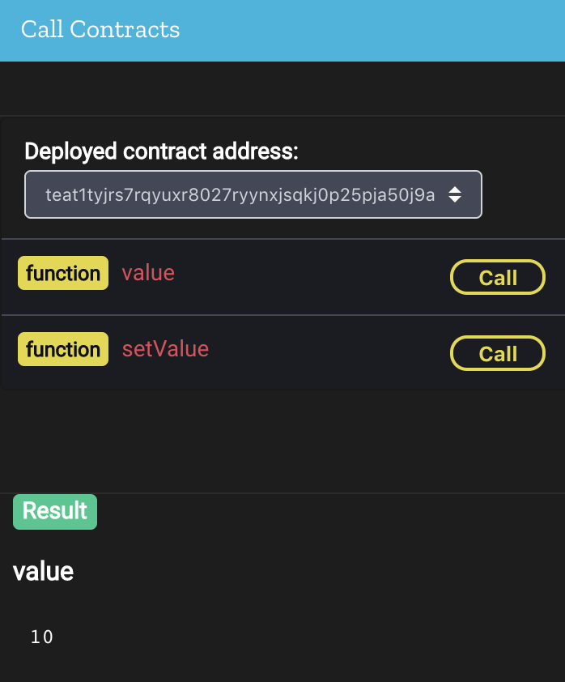
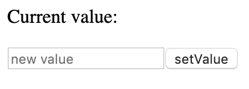

# Getting Started

This guide's purpose is to get you started with Icetea blockchain programming. After 30 minutes, you'll know:

- How to author a simple smart contract
- How to build, deploy, and interact with smart contracts

## Before you begin

### Skill requirements

- Basic understanding of JavaScript
- Knowledge of how blockchain works and experience of coding smart contract for other blockchains are useful but not required.

### Tools

We will use some available online tools.

1. [Icetea Studio (https://studio.icetea.io)](https://studio.icetea.io)
2. [CodePen (https://codepen.io)](https://codepen.io)

Later, when developing more complex dApps, more advanced tools will be introduced.

## Create the first smart contract

### What is a 'smart contract'?

Ethereum infamously popularized the term 'smart contract'. It is better to ignore the meaning of the word 'contract' and think of it as a service, either stateful or stateless, hosted on blockchain. We will need to write the contract source code, compile it, then deploy it to the blockchain. After deployment, clients could send messages and exchange data with the contract.

### What contract will we create?

In this guide, we will create a contract named `SimpleStore`. Any user can set arbitrary values to the contract. However, it stores the last value only. Setting new value overwrites current one. Users can query for the contract's current value.

We will also make a simple web page to let users interact with the contract.



### Start with an empty contract

We'll write the first smart contract in JavaScript. Let's head to [Icetea Studio](https://studio.icetea.io) and create an 'Empty JavaScript Smart Contract'.

Click on the `mycontract.djs` file.  It should look like this.
```javascript
@contract class MyContract {

}
```

It is just a plain and ordinary JavaScript (ES6) class. The `@contract` decorator is there simply to indicate that this is a smart contract.

First, rename the the class to `SimpleStore` and add a field named `value`.
```javascript{2}
@contract class SimpleStore {
  value = 0
}
```
`0` is the intial value. If you don't set, it defaults to `undefined`. The code snippet above uses [class instance field syntax](https://developers.google.com/web/updates/2018/12/class-fields) which is an ES2019 proposal. Icetea supports most of the recent ES proposals out of the box, so you can utilize modern JavaScript confidently without the need of transpiling with tools like Babel.

### Specify contract state

There is one thing to note. Although `value` is a contract _field_, its value _may not persist_ between external calls (that is, calls from client or from other contracts). The reason is that, due to memory restriction, the blockchain runtime might choose to serialize some of the contract instances to disk and load them back later. During this process, regular fields' values are discarded. To keep a field's value, you need to mark it with `@state`.
```javascript{2}
@contract class SimpleStore {
  @state value = 0
}
```
Now `value`'s value will persist between external calls. We can say it is part of the contract's _persistent state_, or just _state_ for short.

::: warning NOTE
Not every JavaScript type can be marked as `@state`. Currently, only values of types such as `number`, `string`, `boolean`, plain object, or array of those types can be serialized.
:::

### Access to contract state

Next, let's add getter and setter for `value`.
```javascript
@contract class SimpleStore {
  @state value = 0
  getValue() {
    return this.value
  }
  setValue(value) {
    this.value = value
  }
}
```

The contract now can be built successfully. However, none of its methods is visible to external callers (in other words, they are _internal methods_). To make a method externally accessible, you need to mark it with one of the following _state access decorators_.

| Decorator    | Meaning |
| ------------ | ------- |
| @transaction | Indicate that this method updates contract state. |
| @view        | This method reads (i.e. _view_) contract state, but it won't update. |
| @pure        | This method does not access contract state (neither read nor update). This decorator is often applied to utility functions. |
| @payable     | Same as @transaction with one addition: user can attach some amount of asset when calling the method. If you don't understand what that means, just ignore for now, we'll come back later. |

::: warning NOTE
__@transaction__ and __@payable__ methods are resource-intensive. Callers must send a transaction in order to invoke this kind of method. Transactions require consensus on blockchain network, and thus cost some fees. Therefore, never use these decorators if the method does not change state.

__@pure__ methods are light-weight and should always be used if state access is not required.
:::

In our example, `getValue` reads contract state (i.e. `value`) while `setValue` updates it. So let's add the corresponding decorators.

```js{3,6}
@contract class SimpleStore {
  @state value = 0
  @view getValue() {
    return this.value
  }
  @transaction setValue(value) {
    this.value = value
  }
}
```

You can also remove `getValue` method and make `value` externally assessible by marking it with `@view`.
```js{2}
@contract class SimpleStore {
  @view @state value = 0
  @transaction setValue(value) {
    this.value = value
  }
}
```

::: tip NOTE
The only valid state access decorator for fields is `@view`. Therefore, you cannot mark `value` as `@transaction` and remove `setValue` method.
:::

That's it. Next, we'll deploy it to the Icetea testnet for testing.

### Deploy and test

Take a look at the Icetea Studio toobar.


- __Build__: compile the contract. It will output to `out/mycontract.js` file upon success. _If you change the file content, don't forget to save (Ctrl/Cmd + S) the file before compiling._
- __Deploy__: deploy the compiled contract to Icetea testnet
- __Build & Deploy__: compile first, then deploy if compiling succeeded

After deployment, you can call the contract's methods using _Call Contracts_ panel on the right-hand side of the studio.



::: tip
Each deployed contract is given an address in form of `teat1...`. You can call it anytime later if you know the address. Find the address in the Icetea Studio's Output panel after each time you deploy.
:::

### Add type checking

Our `SimpleStore` contract already works. It can store many types of values: `number`, `string`, `boolean`, array, plain object. That's due to the dynamic nature of JavaScript type system.

But what if you want to store only numbers? Just add some [Flow](https://flow.org/)-style type annotations.
```js{2,3}
@contract class SimpleStore {
  @view @state value: number = 0
  @transaction setValue(value: number) {
    this.value = value
  }
}
```

Because they are valid Flow type annotations, you can use [Flow tool](https://flow.org/en/docs/install/) for _static_ type checking if you wish to. In addition, Icetea also provide some basic _runtime_ type checking. Try deploy the above contract and call `setValue`, passing a string to see what happens!

::: tip NOTE
Icetea does not perform runtime type check for nested objects. This is done intentionally for the sake of simplicity and performance. If you want to perform complex runtime type checking, no need to worry. Icetea allows your contract to access to robust type checking and input validation packages like `@hapi/joi` , `ajv` , `validator` to get the job done.
::: 

### Validate input

Now, let's add one more requirement: our `SimpleStore` shall accept only _non-negative integer_.  To do this, simply include some code for input validation.

```js{4,5,6}
@contract class SimpleStore {
  @view @state value: number = 0
  @transaction setValue(value: number) {
    if (value < 0 || !Number.isInteger(value)) {
      throw new Error('Value must be a non-negative integer.')
    }
    this.value = value
  }
}
```

As you can see, to inform the caller about an error, just `throw` it. This will stop processing immediately and _undo all state changes_.

To try out how to use external package, let's rewrite the validation logic with [@hapi/joi](https://github.com/hapijs/joi).
```js
// You can require Node package, like this
const Joi = require('@hapi/joi')

@contract class SimpleStore {
  @view @state value: number = 0
  @transaction setValue(newValue: number) {
    const { value, error } = Joi.validate(
      newValue, // value to validate
      Joi.number().integer().min(0) // schema
    )
    if (error) {
      throw error
    }
    this.value = value
  }
}
```

The validation logic of this contract is very simple and no need to use `@hapi/joi` - it is here just because we  want to demo how it works. Check out [@hapi/joi documentation](https://github.com/hapijs/joi/blob/v15.0.3/API.md) if your contract requires complex validation.

::: tip NOTE
If you want to use _assertion_ to test invariants, you can `require('assert')` to use Node's 'assert' core module.
:::

### Use utilities to simplify code

The use of `Joi.validate` and `throw new Error` above is still not elegant enough. Let's try using the special `;` package to simplify it a bit.

```js{2,6}
const Joi = require('@hapi/joi')
const { validate } = require(';')
@contract class SimpleStore {
  @view @state value: number = 0
  @transaction setValue(value: number) {
    this.value = validate(
      value, // value to validate
      Joi.number().integer().min(0) // schema
    )
  }
}
```

The `;` package's `validate` function will throws if it encounters errors, so we don't need to throw manually. It will return the sanitized value on success.

::: tip
The magic `;` module is in fact an alias to `@iceteachain/utils/utils` package. It also exports some other handy functions.

- `revert`: stop processing and undo all state changes. `revert(message)` is equivalent to `throw new Error(message)`
- `expect`: revert the transaction if the specified condition is not met. It is similar to Solidity's `require` function.
- `toMicroUnit`/`toStandardUnit`: convert a currency back and forth between standard unit (which is user-friendly) and micro unit (which is used internally by Icetea to store balance, fees, etc.)

> 1 standard unit = 10<sup>6</sup> micro unit
:::

Voala! Try build and deploy the contract and play around with it a bit.

## Access to blockchain data

### The additional requirement

Our `SimpleStore` works just fine, but let's imagine this: the client requests one additional feature. They want to be informed each time someone changes `SimpleStore`'s `value`. These are the details they want to know:
- Who changes it
- What is the old value
- What is the new value

How do we do that with Icetea blockchain?

### Interact with runtime environment

To obtain necessary data for the new feature, the contract need to interact with the runtime environment. To be specific, it need to:
- Query the blockchain for the address of the account who made the transaction
- Request the runtime to emit an event each time someone change the value

There are 3 categories of data and actions a contract can interact with the runtime enviroment.

#### Contract data & actions
- `address`: the address of current contract
- `balance`: the balance of current contract
- `deployedBy`: the address of the account who deployed this contract
- `transfer(to, amount)`: transfer an asset value from this contract to other account
- `emitEvent(name, data)`: emit an event associated with this contract

To access contract data, use `this`. For example:

```js{3,5,7}
@contract class RichMan {
  @transaction donate(receiver: string) {
    const amount = this.balance
    // donate entire balance
    this.transfer(receiver, amount)
    // emit an event about this
    this.emitEvent('Donate', { receiver, amount })
  }
}
```

#### Blockchain data
- `msg`: data about current call, like `sender`, `signers`, `value` (amount of asset being transferred), etc.
- `block`: data about current block, like `height`, `hash`, and `timestamp` (in _milliseconds_).

These blockchain data are made global, so you can access them directly. For example:

```js{6,8,9,16}
@contract
class RichMan {
  @transaction
  test() {
    // Access to block data
    const blockTime = new Date(block.timestamp)
    // Access to message data
    const she = msg.sender
    const methodName = msg.name // this should equal 'test'
    return `${she} calls ${methodName} at ${blockTime}.`
  }

  @transaction
  donate(receiver: string) {
    // Only contract deployer can perform donation
    if (msg.sender === this.deployedBy) {
      // donate entire balance
      this.transfer(receiver, this.balance)
    }
  }
}
```

::: warning NOTE
Only trust the value of `msg` if it is a transaction (i.e. it is inside a `@transaction` or `@payable` method). With `@view` and `@pure` methods, a caller can set `msg.sender ` to any value he/she wishes to because there is no need to _sign_ (i.e. attach a digital signature to) the message.
:::

#### Runtime functions
- `balanceOf(address)`: get the balance of other account
- `loadContract(address)`: load another contract to call its methods
- `require(package)`: load a Node package

These runtime functions are also made global.

```js{1,5}
const { expect } = require(';')
@contract class RichMan {
  @transaction donate(receiver: string) {
    // ensure the receiver has balance of zero
    expect(!balanceOf(receiver), 'Donate to zero-balance account only.')

    // donate entire balance
    this.transfer(receiver, this.balance)
  }
}
```

Details about these data and functions are available in Reference section. For now, let's come back to the `SimpleStore`'s newly requested feature.

### The complete contract

With all the knowledge we learnt together so far, let's finish our contract.

```js
const Joi = require('@hapi/joi')
const { validate } = require(';')

@contract
class SimpleStore {

  @view @state value: number = 0

  @transaction setValue(value: number) {
    // save old value
    const oldValue = this.value

    // validate and sanitize input
    this.value = validate(
      value, // value to validate
      Joi.number().integer().min(0) // schema
    )

    // emit event
    this.emitEvent('ValueSet', {
      by: msg.sender,
      oldValue: oldValue,
      newValue: this.value
    })

    // return the old value
    return oldValue
  }
}
```

That's it. Now go playing with it. Here is the [complete version on Icetea Studio](https://studio.icetea.io/?f=4shrjq3j5gf).

## Programmatically call contracts

In this step, we will learn how to programmatically interact with the `SimpleStore` contract we created during last step.

Any Icetea node may choose to expose an RPC interface so that clients can query for blockchain data and interact with contracts. However, working with that RPC directly is a little cumbersome, so we will make use of the [@iceteachain/web3](https://github.com/TradaTech/icetea-web3) library. It is a handy wrapper around the Icetea node' RPC.

### Setup @iceteachain/web3

To start, let's create a new pen on [codepen.io](https://codepen.io). First, add link to `@iceteachain/web3` to the beginning of your HTML.
```html
<script src="https://cdn.jsdelivr.net/npm/@iceteachain/web3@0.1.14/dist/browser.min.js"></script>
```

Then, craft a simple UI.

```html
<p>Current value: <span id=‘value’></span></p>
<p><input id=‘newValue’ placeholder=‘new value’>
<button id=‘setValue’>setValue</button></p>
```
It should look something like this.



Switch to JS editor and add some code to initialize an `IceteaWeb3` instance.

```js
// wrap around an Icetea node' RPC
const tweb3 = new icetea.IceteaWeb3('wss://rpc.icetea.io/websocket')

// create a new random account, needed when calling setValue
tweb3.wallet.createAccount()

// Note: replace the contract address with your actual address
const contract = tweb3.contract('teat1tat8qw9s9ave7gfgq3tw0vccvrdguc743hrea8')
```

::: tip DO I NEED AN ACCOUNT?
You don't need to `createAccount` when calling `@view` and `@pure` methods. The account is required only to sign transactions. In our example, we'll need to call `setValue` which is a `@transaction`, so we need to create one. You can also use `tweb3.importAccount` to import an existing account.
:::

Add a helper function to 'boost productivity' :D
```js
// A helper function
function byId(id) {
	return document.getElementById(id)
}
```

### Call contract methods

On page load, we need to query `SimpleStore` for its current value and display it onscreen. To do this, let's add a call to constract's `value` (it is a contract's field, but we'll need to 'call' the fields as if they are methods).

How do you call a contract method? First, obtain a reference to it, then invoke either `callPure`, `call`, or `send` depending on whether it is a `@pure`, `@view`, or `@transaction` method, respectively.

```js{2}
// do at page load to display current value
contract.methods.value().call().then(function(value) {
	byId('value').textContent = value
})
```
Next, register event handler for `setValue` button.

```js{3}
byId('setValue').addEventListener('click', function() {
  const newValue = parseInt(byId('newValue').value)
  contract.methods.setValue(newValue).sendAsync()
})
```

There are 3 ways to invoke a contract's `@transaction` method: `sendAsync`, `sendSync`, and `sendCommit`. We'll explain the difference shortly. Before that, look carefully: we pass the parameter `newValue` to `setValue` instead of to `sendAsync`. This is something you must remember and get familliar with, because it is not very intuitive at first.

Now, back to the `sendXXX` stuff.
- `sendAsync`: send the transaction and return immediately without waiting for any kind of confirmation
- `sendSync`: send the transaction and wait until it passes preliminary check and be accepted as a _pending transaction_.
- `sendCommit`: send the transaction and wait until it is included into the blockchain. Note that the transaction might succeed or fail (e.g. the contract method throws an error), but whatever the result is, the transaction was included pernamently into the blockchain.

Back to our example, we want to display the new value after each committed change, so we should switch from `sendAsync` to `sendCommit`.

```js
byId('setValue').addEventListener('click', function() {
  const newValue = parseInt(byId('newValue').value)
  contract.methods.setValue(newValue).sendCommit().then(function() {
    byId('value').textContent = newValue
  })
})
```

[EDIT ON CODEPEN](https://codepen.io/thith/pen/jjNzeJ)

It works great. But there's one shortcomming: if Alice updates value, the updated value won't show on Bob's screen. Bob must reload the web page to get the updated value. Is there a way to help Bob? He does not like to reload screen every now and then that much :(

Think about this a little bit...

Yes! Events to the rescue! Remember that our contract emits an event called `ValueSet`, doesn't it? Subscribe to an event is straitforward, look at this.

```js
const filter = {}
contract.events.ValueSet(filter, function(error, data) {
  if (error) {
    console.error(error)
    byId('value').textContent = String(error)
  } else {
    byId('value').textContent = data.newValue
  }
})
```

Just like we access a contract's method with `contract.methods.someMethodName`, we subscribe to an event with `contract.events.SomeEventName`. Pass a filter object (ignore it for now) and a callback function. The callback will get called each time the contract emits an event of that type.

::: tip NOTE
Events emit before the time of subscription will not trigger the callback.
:::

If you've gone this far, well-done! You are an Icetea Blockchain Developer now :D. Let's take a look at what we've done.

<iframe height="484" style="width: 100%;" scrolling="no" title="Icetea: NumberStore" src="//codepen.io/thith/embed/wbRLyd/?height=484&theme-id=0&default-tab=js,result" frameborder="no" allowtransparency="true" allowfullscreen="true">
  See the Pen <a href='https://codepen.io/thith/pen/wbRLyd/'>Icetea: NumberStore</a> by Truong Hong Thi
  (<a href='https://codepen.io/thith'>@thith</a>) on <a href='https://codepen.io'>CodePen</a>.
</iframe>

In the next chapters, we'll learn how to make more complex dApps and chatbots.
